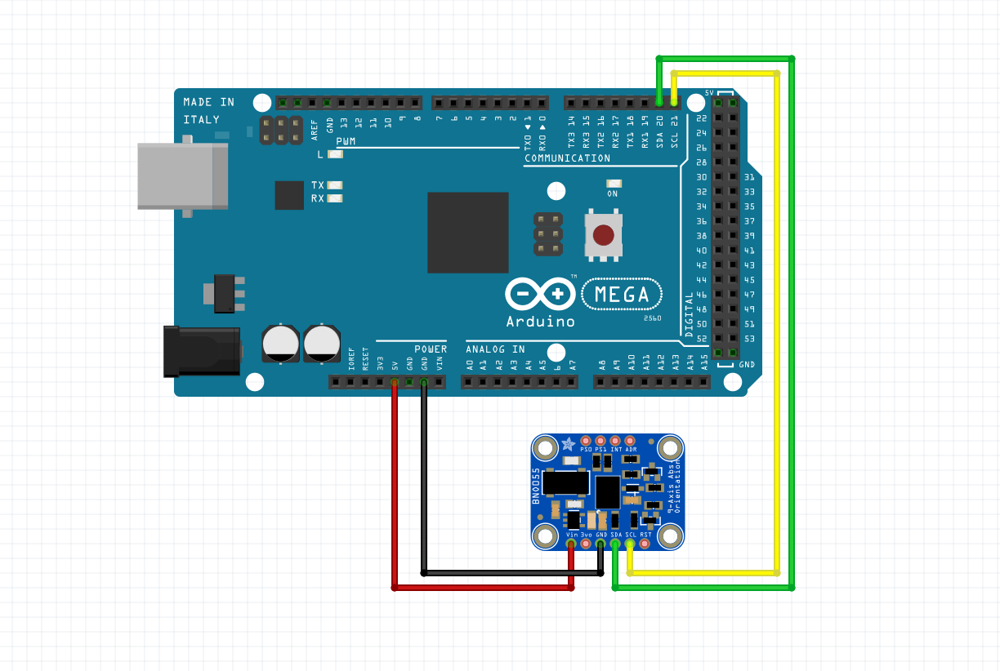

# BNO Magnetometer:

 - SDA: (Serial Data A) Mega Digital Pin 20 (SDA)
 - SCL: (Serial Clock) Mega Digital Pin 21 (SCL)

## Code
In order to read the data from the BNO055, the official method requires installing the manufacturer's libraries `Adafruit_Sensor` and `Adafruit_BNO055`. This can be done through the Arduino IDE by going to `Sketch -> Include Library -> Manage Libraries` and searching for both of them.

```cpp
#include <Adafruit_Sensor.h>
#include <Adafruit_BNO055.h>

// Call the Adafruit_BNO055 constructor, creating a global object to use throughout the runtime of the program.
Adafruit_BNO055 bno(55);

void setup() {
    // If the bno fails to initialize, loop indefinitely. This should output some sort of debugging message because it will halt the program's execution.
    if (!bno.begin())
        while(true) {}
    delay(1000);
    bno.setExtCrystalUse(true);
}

void loop() {
    // Update the event handler inside of the bno. This will set all of the updated event data into our 'eventData' variable, including the member variable, orientation, which we will most likely be using.
    sensors_event_t eventData; 
    bno.getEvent(&eventData);

    // Now, 'eventData.orientation' has all .x, .y and .z set to be the correct values.
}
```
