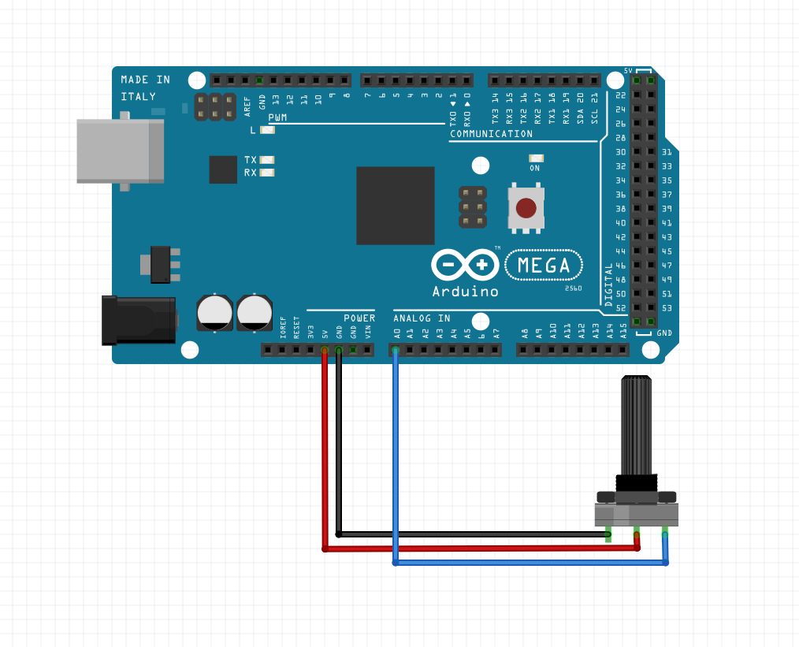

# Rotary Encoder

The rotary encoder is the simplest analog device possible to use. Like everything, it requires a voltage supply and ground line, but besides that, it only requires a single analog pin to read its value.


 - 5V: (Power) Mega 5V pin
 - GND: (Ground) Mega Ground Pin
 - A: (Data Read) Mega Analog Pin **UNDECIDED**

In order to read the value incoming from the rotary encoder, one would write some very simple Arduino code:

```cpp
// This is a placeholder pin value and is subject to change.
constexpr auto ROTARY_ENCODER_PIN = A0;

void setup() {
    // Firstly, we need to tell the Arduino to put the specified pin into listening mode. This will allow us to read from the pin when there is incoming data.
    pinMode(ROTARY_ENCODER_PIN, INPUT);
}

void loop() {
    auto rotaryEncoderValue = analogRead(ROTARY_ENCODER_PIN);
    // The variable 'rotaryEncoderValue' will be an integral value in the range [0, 1023]. Because of this, if one would like the value in some other range, radians, for example, they would first cast it's value to floating point, divide it by 512, and then multiply it by pi (3.14159..):
    auto rotaryInRadians = 3.141592654f / 512 * rotaryEncoderValue;
}
```
