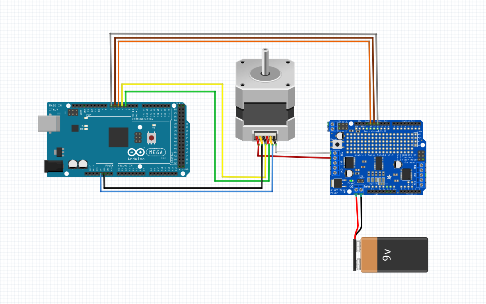

# Motor (with H.E. sensor)

 - M1: (Direction control 1) Motor Controller OUT1
 - GND: (Ground) Mega Ground Pin
 - C1: (Direction speed 1) Mega Digital PWM Pin **UNDECIDED**
 - C2: (Direction speed 2) Mega Digital PWM Pin **UNDECIDED**
 - VCC: (Power) Motor Controller 5 Volt
 - M2: (Direction control 2) Motor Controller OUT2

# Motor Controller

 - 5V (Power) Both into the Mega 5V pin and the H.E. Motor 5V
 - GND (Ground) 12V Battery negative
 - 12V (Power) 12V Battery positive (requires a fuse)
 - ENA (Enabler A) Mega Digital Pin **UNDECIDED**
 - IN1 (Direction switch 1) Mega Digital Pin **UNDECIDED**
 - IN2 (Direction switch 2) Mega Digital Pin **UNDECIDED**

```cpp
void setup() {

}

void loop() {

}
```
