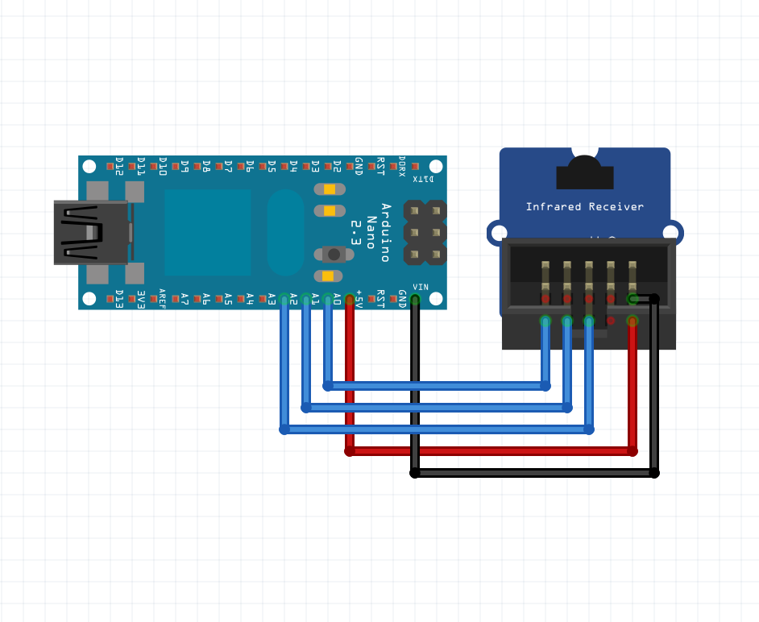
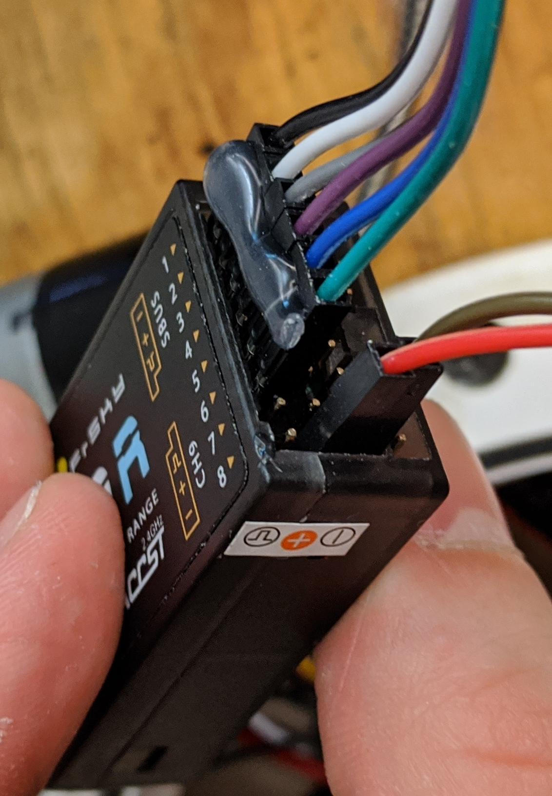

Diagram | Photo
:---:|:---:
 | 
Disregard the fact that there are only 2x5 pins on the receiver's header in the image. The real receiver has 24 (3x8) pins as described in the table below.

# Remote Controller Receiver

| Pin | `+` (pos) | `-` (neg) | `_/¯\_` (data) |
|:---:|:---:|:---:|:----:|
|  1  |  *  |  *  | Nano Analog Pin 1: **UNDECIDED** | 
|  2  |  *  |  *  | Nano Analog Pin 2: **UNDECIDED** |
|  3  |  *  |  *  | Nano Analog Pin 3: **UNDECIDED** |
|  4  |  *  |  *  | Nano Analog Pin 4: **UNDECIDED** |
|  5  |  *  |  *  | Nano Analog Pin 5: **UNDECIDED** |
|  6  |  *  |  *  | Nano Analog Pin 6: **UNDECIDED** |
|  7  |  *  |  *  |   *  |
|  8  | 5V  | GND |   *  |

(an `*` means unused)

```cpp
// TODO: add the code from the master code
void setup() {

}

void loop() {

}
```
